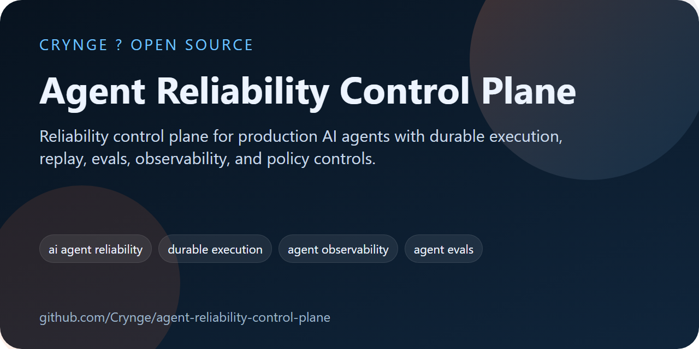

# Agent Reliability Control Plane

<!-- portfolio-seo:start -->
  



> Reliability control plane for production AI agents with durable execution, replay, evals, observability, and policy controls.

**GitHub Search Keywords:** ai agent reliability, durable execution, agent observability, agent evals, replayable incidents, control plane, typescript sdk, python sdk

<!-- portfolio-seo:end -->

<!-- portfolio-links:start -->
<div align="center">

[Documentation](docs) &middot; [Architecture](docs/architecture.md) &middot; [Contributing](CONTRIBUTING.md) &middot; [Security](SECURITY.md) &middot; [Authors](AUTHORS.md) &middot; [Workflows](.github/workflows)

</div>
<!-- portfolio-links:end -->


Agent Reliability Control Plane is a startup-style prototype for teams shipping multi-step AI agents in production. It focuses on the painful operational gap between a working demo and a resilient system: failed recovery, weak observability, poor replay, unsafe retries, and missing approval controls.

This prototype ships with:

- a durable-run HTTP API built on Node's standard library
- a visual control dashboard for runs, failures, checkpoints, and eval scenarios
- a TypeScript client SDK
- a Python client SDK
- seeded reliability scenarios and policy examples
- built-in tests for run lifecycle and recovery behavior

## Folder layout

```text
agent-control-plane/
  apps/dashboard/          visual control plane UI
  docs/                    product and architecture notes
  packages/sdk-ts/         TypeScript SDK
  packages/sdk-py/         Python SDK
  server/                  durable execution API
  tests/                   node:test coverage
  storage/                 JSON persistence
  package.json
```

## Product promise

The narrow promise is simple:

> Your agent can fail, pause, retry, and resume safely without losing context or corrupting workflow state.

## Quick start

1. From `agent-control-plane/`, run `npm install`.
2. Run `npm run start`.
3. Open [http://localhost:4020](http://localhost:4020).
4. Explore the seeded runs, checkpoints, failures, approvals, and replay flows.

## API overview

- `POST /api/runs/start`
- `POST /api/runs/:id/checkpoints`
- `POST /api/runs/:id/resume`
- `POST /api/runs/:id/failures`
- `POST /api/runs/:id/approvals`
- `POST /api/runs/:id/replay`
- `GET /api/runs`
- `GET /api/runs/:id`
- `GET /api/analytics/summary`
- `GET /api/evals/scenarios`
- `GET /api/policies`

## Design assumptions

- Storage is JSON-backed for clarity and hackability.
- The runtime favors explicit, structured steps over hidden autonomous loops.
- Every checkpoint carries state, output, and tool events.
- Every failure is classified and replayable.
- Every approval request is explicit and auditable.

## Why this exists

Most agent teams do not need a "more autonomous" model first. They need:

- durable state
- reproducible traces
- safe retries
- policy gates
- evals for ugly real-world inputs

This prototype is built to make that product direction concrete.
